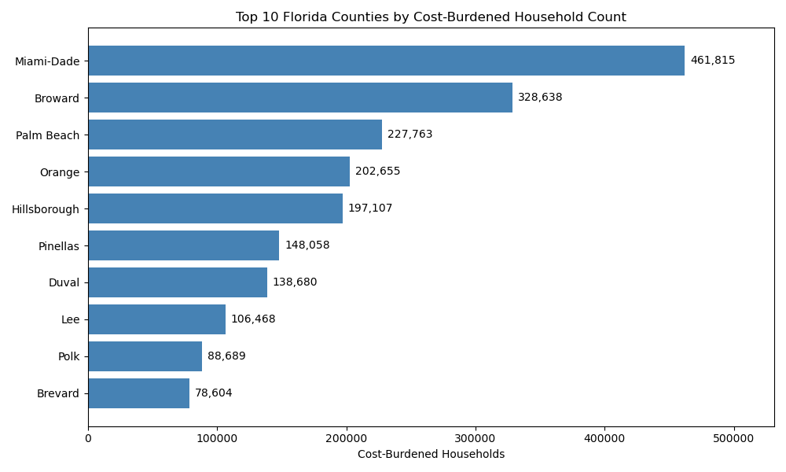
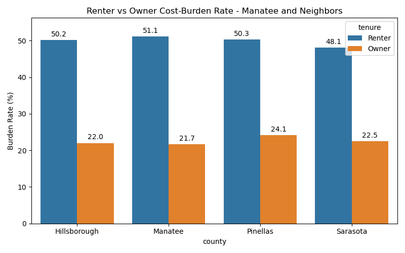
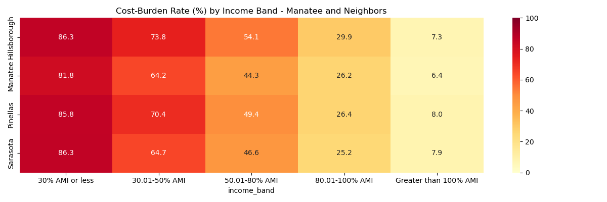
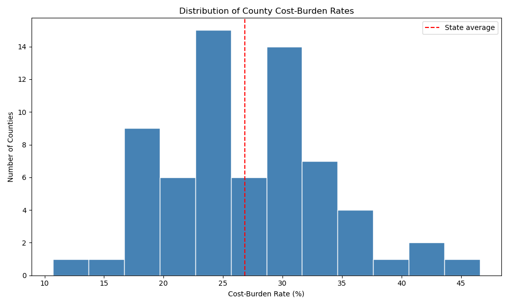
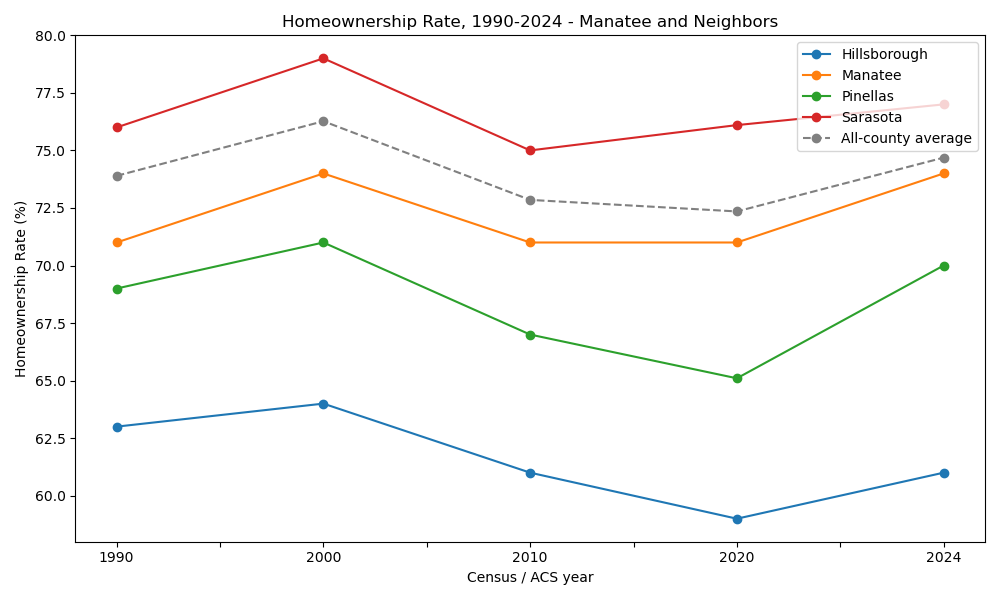
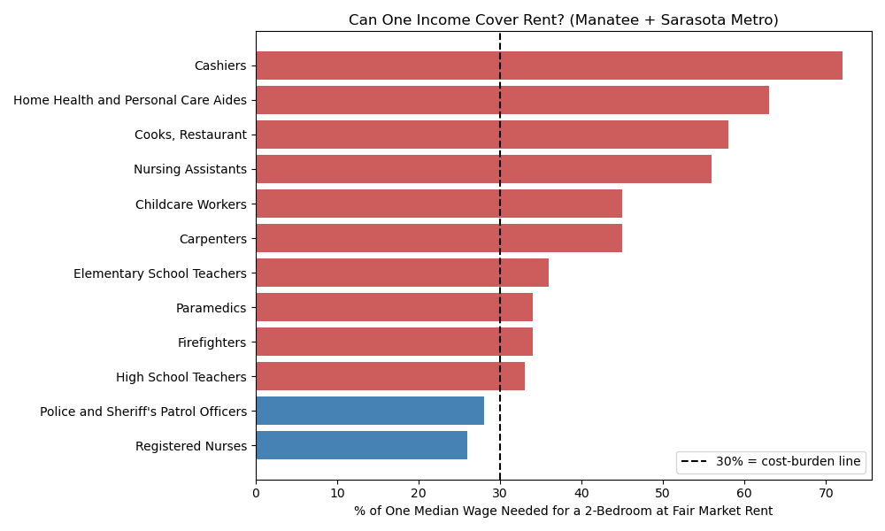
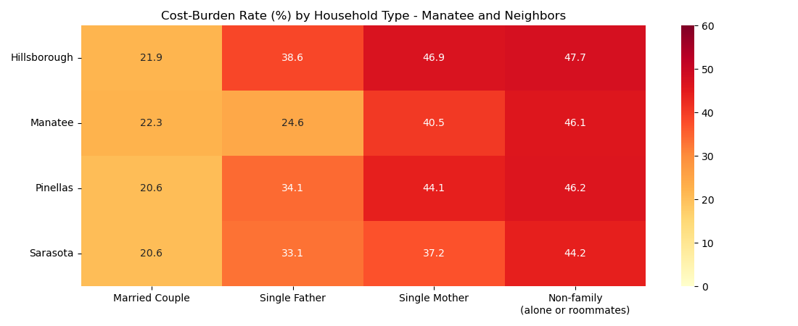
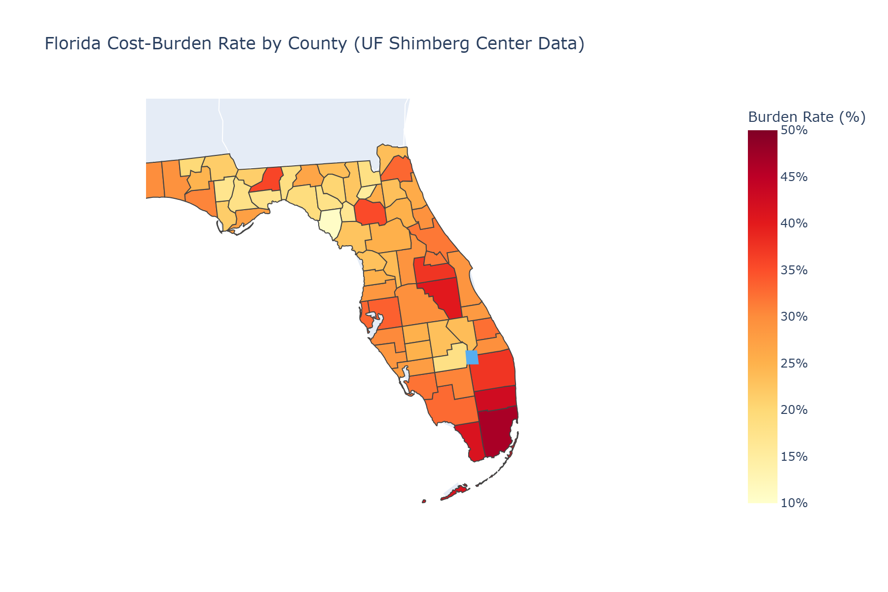
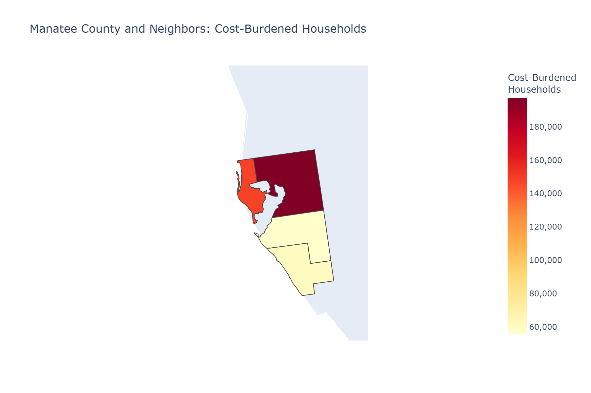

# Florida Housing Cost Burden Analysis

**Mapping where Florida households are priced out - and which incomes, jobs, and family types feel it most - with a focus on Manatee County and its neighbors.**

I built this as a portfolio project using Python, real housing data from the **UF Shimberg Center** (my alma mater), and a question I actually care about as a Florida resident.

**Source code:** [github.com/dexC166/fl_cost_burden_analysis_2026](https://github.com/dexC166/fl_cost_burden_analysis_2026) | **Live page:** [dexc166.github.io/fl_cost_burden_analysis_2026](https://dexc166.github.io/fl_cost_burden_analysis_2026/)

---

## What is "Cost Burden"? (Plain English)

**Housing cost burden** is a simple idea:

> If a household spends **more than 30% of its income** on housing cost (rent, mortgage, taxes, insurance, utilities), it is **cost-burdened**.

The 30% threshold is the standard definition from **HUD** (U.S. Department of Housing and Urban Development), and it's what this Shimberg dataset uses.

**What counts as a household?** One home = one household. Everyone living there (a married couple, roommates, a family) shares **one combined income** and **one set of housing costs**. The 30% rule compares those totals, not each person's paycheck separately.

**Example:** A family earns \$3,000/month. If housing costs more than \$900/month, they are cost-burdened, leaving less for food, childcare, healthcare, and savings.

Housing experts often split it further:

| Term                         | What it means                         |
| ---------------------------- | ------------------------------------- |
| **Not cost-burdened**        | Housing costs 30% of income or less   |
| **Moderately cost-burdened** | Housing costs 31-50% of income        |
| **Severely cost-burdened**   | Housing costs more than 50% of income |

## What is "Area Median Income" (AMI)? (Plain English)

The dataset also groups households by income level, measured against **Area Median Income**:

> Line up every household in a county by income. The one in the middle is the **median**. AMI bands describe how a household's income compares to that local midpoint.

**Example:** If a county's median income is \$80,000, then "30% AMI or less" means that household earns \$24,000 or less - very low income _for that area_. "Greater than 100% AMI" means earning more than the county median.

**The real numbers for my home area** (2024 median household income, from `Sheet 5` of the same Shimberg export):

| County       | All households | Owners    | Renters  |
| ------------ | -------------- | --------- | -------- |
| Hillsborough | \$85,183       | \$112,238 | \$57,605 |
| Sarasota     | \$83,003       | \$95,105  | \$60,628 |
| Manatee      | \$81,395       | \$95,294  | \$61,281 |
| Pinellas     | \$73,832       | \$85,139  | \$55,310 |

So in Manatee, "30% AMI or less" works out to roughly **\$24,000/year or less**. (These ACS medians are a close proxy for HUD's official AMI, which is set per metro area rather than per county. Notice renters earn only one-half to two-thirds of what owners earn - a preview of the renter-vs-owner finding below.)

Why use the _local_ median instead of one statewide number? Because \$50,000 stretches much further in a small rural county than in Miami-Dade. AMI keeps the comparison fair county by county.

**Note:** The two 30%s are different things. The **30% cost-burden rule** is about _spending_ (housing costs vs. household income). The **"30% AMI or less" band** is about _earning_ (your income vs. your county's median income).

---

## Why This Project Is Useful

High cost burden is linked to housing instability, longer commutes, and families cutting back on essentials like food and healthcare. The raw data exists, but it sits in spreadsheets. This project turns it into maps and charts that show **where** the problem is concentrated, **who** it hits hardest (renters, low-income households, single mothers, everyday workers like teachers and paramedics), and **how** my home area compares to the rest of Florida.

**Who can benefit from it:**

- **City and county planners** - see which areas need affordable housing investment most
- **Housing nonprofits and advocates** - back up grant applications and outreach with county-level numbers
- **Local journalists and residents** - get a plain-English picture of housing affordability in their county
- **Students and analysts** - reuse the notebook as a template for any state's housing data

**Community impact:** I live in Manatee County, and this analysis shows that about 1 in 3 households here and in neighboring counties are cost-burdened - and that renters are hit roughly twice as hard as owners. Putting those numbers on a map makes the problem concrete for local decision-makers instead of abstract. Anyone can re-run the notebook with a fresh Shimberg download to keep the picture current.

---

## The 7 Questions This Project Answers

Each answer comes straight from `notebooks/01_fl_housing_cost_burden_analysis.ipynb` (section numbers in italics). The notebook's final summary cell computes every one of these numbers live from the data - nothing is typed in by hand.

#### 1. Which Florida counties have the most cost-burdened households, by count and by rate?

Answer:

##### Miami-Dade, on both measures.

- Most cost-burdened households: **461,815**
- Highest burden rate of any county: **46.6%**, with Broward next at 42.6%

_(Sections 2-4; Section 10 summary)_



#### 2. In Manatee County and its neighbors, do renter or owner households have a higher cost-burden rate?

Answer:

##### Renters, about twice as burdened as owners.

- Renters: **48-51%** cost-burdened in all four counties
- Owners: only **22-24%**

_(Section 5, renter vs owner bar chart; Section 10 summary)_



#### 3. Which income groups have the highest cost-burden rates in Manatee County and its neighbors?

Answer:

##### The lowest earners, and burden drops steadily as income rises.

- Households at **30% AMI or less**: over **80%** are cost-burdened
- Households above **100% AMI**: under **10%**
- In dollars: Manatee's median household income is about \$81,400, so its "30% AMI or less" band means earning roughly \$24,000/year or less (see the AMI explainer above)

_(Section 5, income-band heatmap and median-income table; Section 10 summary)_



#### 4. How do Manatee County and its neighbors compare to the rest of Florida?

Answer:

##### All four sit above the typical Florida county, but below the big urban extremes.

- Average county burden rate (mean of all 67 county rates): **26.8%**
- Statewide rate (all burdened households ÷ all households): **34.1%** - higher than the county average because the biggest counties are the most burdened
- Sarasota: **28.7%** and Manatee: **30.2%** (a bit above the county average)
- Pinellas: **33.1%** and Hillsborough: **33.6%** (further above it)

In the histogram below, the red dashed line marks the 26.8% county average. _(Sections 3-4, Section 6 maps, Section 10 summary, and the Sample Results table below)_



#### 5. Is homeownership in my home area rising or falling?

Answer:

##### Remarkably steady for 35 years.

- Manatee: **71%** in 1990 vs **74%** in 2024; the neighbors barely moved either
- The affordability squeeze shows up in **prices** (cost burden), not in who owns

_(Section 7, homeownership trend line plot)_



#### 6. Can one median wage cover a typical 2-bedroom near home?

Answer:

##### Usually not.

- HUD's 2025 Fair Market Rent for a 2-bedroom in the Manatee + Sarasota metro: **\$1,846/month**
- **10 of the 12** everyday jobs checked need **more than 30%** of a single median wage to cover it
- Cashiers would need **72%** of their income; even elementary school teachers (36%), paramedics and firefighters (34%) cross the line. Only registered nurses (26%) and police officers (28%) stay under it

_(Section 8, wages vs Fair Market Rent bar chart)_
Note: The 12 occupations are a representative slice of the ~54 jobs Shimberg includes on Sheet 18. Public safety, healthcare, education, trades, childcare, and service/retail, all carefully chosen so readers can see whether typical local wages, not just abstract income bands, can cover HUD’s 2-bedroom Fair Market Rent on a single paycheck.



#### 7. Which household types carry the most burden?

Answer:

##### Single-mother families and non-family households (people living alone or with roommates).

- Single-mother families: **37-47%** cost-burdened across the four counties - and **up to 62%** among those who rent
- Non-family households (living alone or with roommates): **44-48%**
- Married couples: only **21-22%**

_(Section 9, household-type heatmap)_



---

## Interactive Maps (Plotly)

The notebook builds two interactive choropleth maps - hover over any county to see its name, burden rate, and household count. `Left-Click` either static preview image below to view and interact with the live map directly in your browser:

[](https://dexc166.github.io/fl_cost_burden_analysis_2026/outputs/figures/florida_map.html)

[](https://dexc166.github.io/fl_cost_burden_analysis_2026/outputs/figures/home_map.html)

---

## Skills Demonstrated

| Tool           | What I did                                                                                                                |
| -------------- | ------------------------------------------------------------------------------------------------------------------------- |
| **Pandas**     | Loaded 7 sheets of Excel data, cleaned messy rows, handled suppressed (blank) values, grouped, pivoted, merged FIPS codes |
| **NumPy**      | Calculated statewide average, median, high/low burden rates                                                               |
| **Matplotlib** | Bar charts, histogram, 1990-2024 time-series line plot, wages-vs-rent chart                                               |
| **Seaborn**    | Income-band and household-type heatmaps, grouped bar chart                                                                |
| **Plotly**     | Interactive Florida and local (Manatee area) choropleth maps, plus static PNG previews via kaleido                        |

---

## Project Structure

```
FL_Cost_Burden/
├── data/
│   ├── affordability-*.xlsx         # Shimberg export (main data)
│   ├── fl_county_fips.csv           # County FIPS lookup for maps
│   └── README.md                    # readme file for data folder
├── notebooks/
│   └── 01_fl_housing_cost_burden_analysis.ipynb
├── outputs/figures/                 # PNG charts + HTML maps (generated by notebook)
├── requirements.txt
└── README.md
```

---

## Quick Start

```bash
git clone https://github.com/dexC166/fl_cost_burden_analysis_2026.git
cd fl_cost_burden_analysis_2026
pip install -r requirements.txt
jupyter notebook notebooks/01_fl_housing_cost_burden_analysis.ipynb
```

Put your Shimberg Excel download in `data/`. Update the filename in the first `read_excel` cell if needed.

---

## Sample Results

Manatee County and its neighbors (statewide totals and top counties are in the Q&A above):

| County       | Cost-burdened households | Burden rate |
| ------------ | ------------------------ | ----------- |
| Hillsborough | 197,107                  | 33.6%       |
| Pinellas     | 148,058                  | 33.1%       |
| Manatee      | 55,725                   | 30.2%       |
| Sarasota     | 60,588                   | 28.7%       |

**Statewide:** 3,045,514 cost-burdened households across 67 counties.

_Note: A few small counties have blank cells in the source data where an estimate was too small to report. The notebook treats those as 0 (with the reasoning explained in Section 1) - leaving them as missing would silently drop whole rows of households and inflate some rural counties' rates by 15-30 points._

---

## Limitations

The honest fine print (Section 11 of the notebook has the full version):

- **Survey estimates, not counts.** All numbers are ACS/CHAS estimates with margins of error - widest for small counties and small subgroups.
- **Suppressed values treated as 0.** Tiny counties' rates carry extra uncertainty.
- **AMI proxy.** County median income approximates HUD's metro-level AMI; "roughly \$24,000" is a good ballpark, not the official cutoff.
- **One earner per household.** The wages-vs-rent chart shows what a _solo_ median-wage worker faces; many households have two earners.
- **Mixed time windows.** Cost burden is 2023, income 2024, household types 2020-2024, Fair Market Rent 2025 - each sheet is used on its own terms.
- **College-town effect.** University counties like Alachua (Gainesville/UF) and Leon (Tallahassee/FSU & FAMU) can read high partly because of off-campus students. The Census measures a household's _own_ income, so students living on parental support, loans, or part-time work can show up as cost-burdened even when their families are not low-income. This does not make their burden fake - students also compete for rentals and push local rents up - but it is a reason to read those counties with extra care. Cleanly separating student from non-student renters would require record-by-record data on individual households (the Census Bureau publishes this as the American Community Survey Public Use Microdata Sample, or "PUMS"); the county-level Shimberg totals used here are already added up, so they cannot isolate that.
- **Descriptive, not causal.** This shows _where_ and _who_, not _why_.

---

## Data Source

[UF Shimberg Center for Housing Studies](https://flhousingdata.shimberg.ufl.edu/), **Affordability** topic, Cost Burden by Income (2023 estimates).

**How to download the Excel file:**

1. Open [flhousingdata.shimberg.ufl.edu](https://flhousingdata.shimberg.ufl.edu/)
2. Click **Affordability** (top menu or topic selector)
3. Under **Geographic Areas: Affordability**, select all Florida counties
4. Click **Next**
5. Click **Download data as Excel** and save the `.xlsx` to `data/`

This project uses seven sheets from that export: `Sheet 1` (all households), `Sheet 2` (renters), `Sheet 3` (owners), `Sheet 4` (homeownership rate 1990-2024), `Sheet 5` (median income by tenure, 2024 ACS), `Sheet 18` (wages by occupation vs 2025 HUD Fair Market Rent), and `Sheet 22` (cost burden by household type, 2020-2024 ACS). See [data/README.md](data/README.md) for details.

**County FIPS lookup (`fl_county_fips.csv`):** Not a Shimberg download. Plotly maps need Census FIPS codes, but the Shimberg data only has county names. This file was built from the [U.S. Census Bureau](https://www.census.gov/library/reference/code-lists/ansi.html) county code list (Florida = state code `12`) and is already included in `data/`. See [data/README.md](data/README.md) for how to recreate it from source.

---

## Author

**Dayle Cortes** - UF Alum, Manatee County, FL
